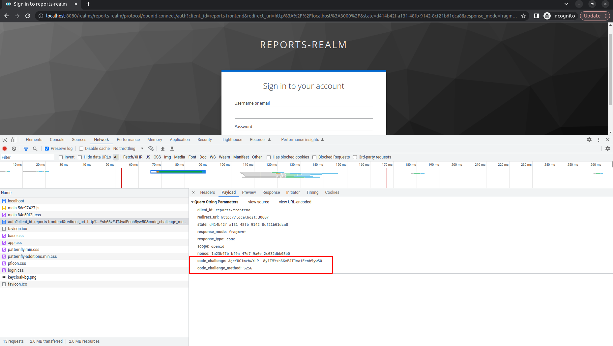
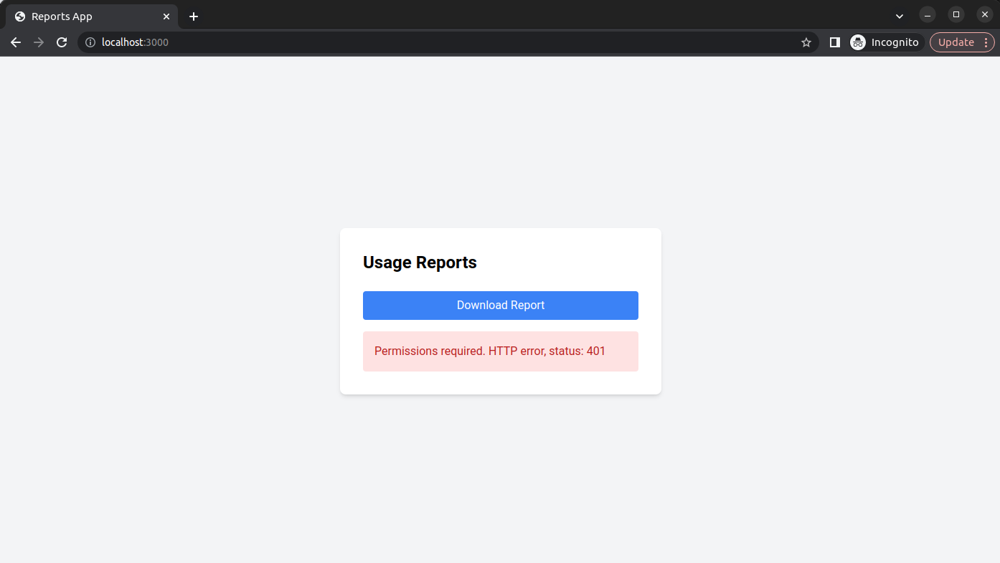
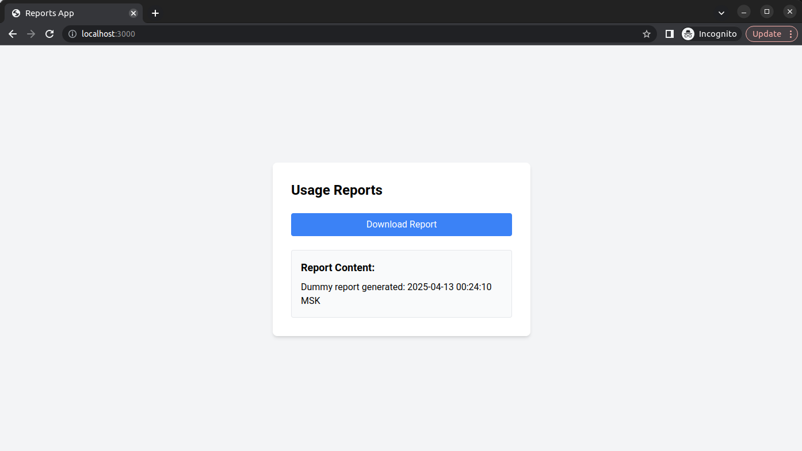

# Login Screen

При открытии страницы `http://localhost:3000`

`"code_challenge_method": "S256"`



```js
HEADER
{
  "alg": "HS256",
  "typ": "JWT",
  "kid": "323e5268-c76a-4866-991f-8838db4ec691"
}
PAYLOAD
{
  "cid": "reports-frontend",
  "pty": "openid-connect",
  "ruri": "http://localhost:3000/",
  "act": "AUTHENTICATE",
  "notes": {
    "scope": "openid",
    "iss": "http://localhost:8080/realms/reports-realm",
    "response_type": "code",
    "code_challenge_method": "S256",
    "redirect_uri": "http://localhost:3000/",
    "state": "d414b42f-a131-48fb-9142-8cf21b61dca8",
    "nonce": "1a23b47b-bf9a-47d7-9a6e-2c632dbb05b0",
    "code_challenge": "AgcYUG1mzhwYLP__8y1TMYsh66vEJTJvaiEenh5yw50",
    "response_mode": "fragment"
  }
}
```

# AUTH - user1@example.com

При успешной авторизации user1@example.com




idToken
```js
HEADER
{
  "alg": "RS256",
  "typ": "JWT",
  "kid": "mGxu6CMlT6oUTVjCRYajyoj85m0LTuXRP4hvG-Cf4GE"
}
PAYLOAD
{
  "exp": 1744492629,
  "iat": 1744492329,
  "auth_time": 1744492329,
  "jti": "0861d266-f18c-4ef0-94d5-fcd8d9b24838",
  "iss": "http://localhost:8080/realms/reports-realm",
  "aud": "reports-frontend",
  "sub": "d84ead42-5d20-44ca-b56c-8e4e3dcdbd24",
  "typ": "ID",
  "azp": "reports-frontend",
  "nonce": "300aee1e-08b3-4f4b-87b0-4adf4b78cdba",
  "session_state": "db8f3194-6deb-4205-aa24-8d2554de6d3b",
  "at_hash": "cXDKUZ6UK3tQ3uIH1SI8oA",
  "acr": "1",
  "sid": "db8f3194-6deb-4205-aa24-8d2554de6d3b",
  "email_verified": false,
  "name": "User One",
  "preferred_username": "user1",
  "given_name": "User",
  "family_name": "One",
  "email": "user1@example.com"
}
```


refreshToken

```js
HEADER
{
  "alg": "HS256",
  "typ": "JWT",
  "kid": "323e5268-c76a-4866-991f-8838db4ec691"
}
PAYLOAD
{
  "exp": 1744494129,
  "iat": 1744492329,
  "jti": "c2d937c4-c28d-46c5-926c-7dd52bc39ae3",
  "iss": "http://localhost:8080/realms/reports-realm",
  "aud": "http://localhost:8080/realms/reports-realm",
  "sub": "d84ead42-5d20-44ca-b56c-8e4e3dcdbd24",
  "typ": "Refresh",
  "azp": "reports-frontend",
  "nonce": "300aee1e-08b3-4f4b-87b0-4adf4b78cdba",
  "session_state": "db8f3194-6deb-4205-aa24-8d2554de6d3b",
  "scope": "openid profile email",
  "sid": "db8f3194-6deb-4205-aa24-8d2554de6d3b"
}
```

token
```js
HEADER
{
  "alg": "RS256",
  "typ": "JWT",
  "kid": "mGxu6CMlT6oUTVjCRYajyoj85m0LTuXRP4hvG-Cf4GE"
}
PAYLOAD
{
  "exp": 1744492629,
  "iat": 1744492329,
  "auth_time": 1744492329,
  "jti": "62ab560a-0581-451b-ba1a-f145d6d6727f",
  "iss": "http://localhost:8080/realms/reports-realm",
  "sub": "d84ead42-5d20-44ca-b56c-8e4e3dcdbd24",
  "typ": "Bearer",
  "azp": "reports-frontend",
  "nonce": "300aee1e-08b3-4f4b-87b0-4adf4b78cdba",
  "session_state": "db8f3194-6deb-4205-aa24-8d2554de6d3b",
  "acr": "1",
  "allowed-origins": [
    "http://localhost:3000"
  ],
  "realm_access": {
    "roles": [
      "user"
    ]
  },
  "scope": "openid profile email",
  "sid": "db8f3194-6deb-4205-aa24-8d2554de6d3b",
  "email_verified": false,
  "name": "User One",
  "preferred_username": "user1",
  "given_name": "User",
  "family_name": "One",
  "email": "user1@example.com"
}
```


# AUTH - prothetic3@example.com

При успешной авторизации prothetic3@example.com



idToken
```js
HEADER
{
  "alg": "RS256",
  "typ": "JWT",
  "kid": "mGxu6CMlT6oUTVjCRYajyoj85m0LTuXRP4hvG-Cf4GE"
}
PAYLOAD
{
  "exp": 1744493008,
  "iat": 1744492708,
  "auth_time": 1744492708,
  "jti": "95f865f4-41b6-459a-8010-957cf5a0a929",
  "iss": "http://localhost:8080/realms/reports-realm",
  "aud": "reports-frontend",
  "sub": "36ab71a4-9e45-4cfc-bce9-242d036e28ea",
  "typ": "ID",
  "azp": "reports-frontend",
  "nonce": "78028f13-7538-4456-841d-b24d2b6cd701",
  "session_state": "e30cef2a-72b6-4e54-abc5-bd628b6a4926",
  "at_hash": "bDK5jBQpMFqKpDyqBaqLqQ",
  "acr": "1",
  "sid": "e30cef2a-72b6-4e54-abc5-bd628b6a4926",
  "email_verified": false,
  "name": "Prothetic Three",
  "preferred_username": "prothetic3",
  "given_name": "Prothetic",
  "family_name": "Three",
  "email": "prothetic3@example.com"
}
```

refreshToken
```js
HEADER
{
  "alg": "HS256",
  "typ": "JWT",
  "kid": "323e5268-c76a-4866-991f-8838db4ec691"
}
PAYLOAD
{
  "exp": 1744494508,
  "iat": 1744492708,
  "jti": "f08e7b11-c332-43a2-b717-432260842cd5",
  "iss": "http://localhost:8080/realms/reports-realm",
  "aud": "http://localhost:8080/realms/reports-realm",
  "sub": "36ab71a4-9e45-4cfc-bce9-242d036e28ea",
  "typ": "Refresh",
  "azp": "reports-frontend",
  "nonce": "78028f13-7538-4456-841d-b24d2b6cd701",
  "session_state": "e30cef2a-72b6-4e54-abc5-bd628b6a4926",
  "scope": "openid profile email",
  "sid": "e30cef2a-72b6-4e54-abc5-bd628b6a4926"
}
```

token
```js
HEADER
{
  "alg": "RS256",
  "typ": "JWT",
  "kid": "mGxu6CMlT6oUTVjCRYajyoj85m0LTuXRP4hvG-Cf4GE"
}

PAYLOAD
{
  "exp": 1744493008,
  "iat": 1744492708,
  "auth_time": 1744492708,
  "jti": "b80b49de-d294-4cde-a078-60d28b439a99",
  "iss": "http://localhost:8080/realms/reports-realm",
  "sub": "36ab71a4-9e45-4cfc-bce9-242d036e28ea",
  "typ": "Bearer",
  "azp": "reports-frontend",
  "nonce": "78028f13-7538-4456-841d-b24d2b6cd701",
  "session_state": "e30cef2a-72b6-4e54-abc5-bd628b6a4926",
  "acr": "1",
  "allowed-origins": [
    "http://localhost:3000"
  ],
  "realm_access": {
    "roles": [
      "prothetic_user"
    ]
  },
  "scope": "openid profile email",
  "sid": "e30cef2a-72b6-4e54-abc5-bd628b6a4926",
  "email_verified": false,
  "name": "Prothetic Three",
  "preferred_username": "prothetic3",
  "given_name": "Prothetic",
  "family_name": "Three",
  "email": "prothetic3@example.com"
}
```